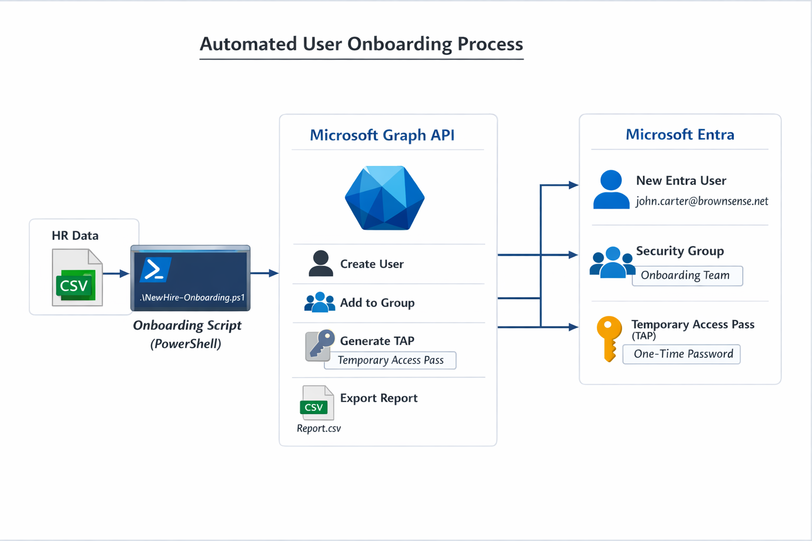

# Automated User Onboarding with Microsoft Entra ID & Microsoft Graph PowerShell

## 📌 Project Overview

This project demonstrates automated user onboarding in a Microsoft Entra ID environment using Microsoft Graph PowerShell.

The solution simulates an HR-driven provisioning workflow where new employees are created from a CSV file, assigned to security groups, and issued a Temporary Access Pass (TAP) for secure passwordless onboarding.

This project reflects real-world Identity and Access Management (IAM) operations performed by IAM Analysts and Identity Administrators.

---

## 🎯 Objectives

- Automate identity provisioning using Microsoft Graph PowerShell
- Implement secure onboarding using Temporary Access Pass (TAP)
- Assign group-based access during provisioning
- Generate operational reporting for onboarding activities
- Demonstrate IAM lifecycle automation skills for portfolio and career readiness

---

## 🏗️ Architecture



Workflow:

HR CSV → PowerShell Automation → Microsoft Graph API → Microsoft Entra ID → User Provisioned with Access

---

## ⚙️ Technologies Used

- Microsoft Entra ID (Azure AD)
- Microsoft Graph PowerShell SDK
- PowerShell Automation
- CSV Data Integration
- Identity Lifecycle Management Concepts

---

## 🔐 Key IAM Concepts Demonstrated

- Identity Provisioning
- Role / Group Assignment
- Zero Trust Onboarding
- Temporary Access Pass (Passwordless Authentication)
- Automation & Scripting
- IAM Operational Reporting

---

## 📂 Project Structure
01-User-Onboarding-Automation
│
├── Scripts
│ └── NewHire-Onboarding.ps1
│
├── Data
│ └── newhires.example.csv
│
├── Architecture
│ └── onboarding-architecture.png
│
└── Screenshots


---

## 🚀 How It Works

1. HR provides new hire information in CSV format
2. PowerShell script reads the CSV file
3. Script creates users in Microsoft Entra ID
4. Users are assigned to a security group
5. Temporary Access Pass is generated for secure first login
6. A report is exported for auditing and tracking

---

## ▶️ How to Run the Script

### Prerequisites

- Microsoft Entra ID tenant
- Global Administrator or Authentication Administrator role
- Microsoft Graph PowerShell module installed
- Temporary Access Pass enabled in Authentication Methods

### Connect to Microsoft Graph

```powershell
Connect-MgGraph -Scopes "User.ReadWrite.All","Group.ReadWrite.All","Directory.ReadWrite.All","UserAuthenticationMethod.ReadWrite.All"
#Run Script
.\NewHire-Onboarding.ps1

📊 Example CSV Input
DisplayName,FirstName,LastName,Department,JobTitle,UserPrincipalName
John Carter,John,Carter,Sales,Sales Rep,john.carter@brownsense.net
Sarah Lee,Sarah,Lee,HR,HR Specialist,sarah.lee@brownsense.net

📸 Screenshots

(Add screenshots here)

Examples:

Script execution

User created in Entra ID

Group membership assignment

Temporary Access Pass creation

🧠 Lessons Learned

Importance of automation in identity lifecycle management

Microsoft Graph permissions and authentication method policies

Handling provisioning delays using retry logic

Real-world IAM troubleshooting techniques

💼 Career Relevance

This project aligns with responsibilities of:

IAM Analyst

Identity Administrator

Azure AD Administrator

Security Operations Analyst (Identity)

Access Management Specialist

🔮 Future Enhancements

Automated license assignment

Email notification for onboarding completion

Integration with Lifecycle Workflows

Parameterized script inputs

Logging improvements

👤 Author

Valdez Brown
IAM & Identity Security Enthusiast

Microsoft Entra Tenant: brownsense.net